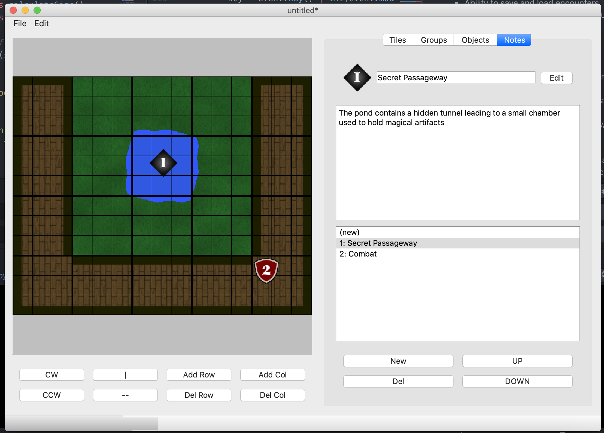

**Version 0.1**

Encounter Mapper is a toolset used for developing tile-based
grid maps for role-playing games such as D&D, etc. The
program allows for the creation of individual tiles that
can be arranged on a grid or map. Also allows for users to place down notes, which can be used to notate details about the particular encounter.

Encounter Builder is developed in Python 3 using PyQT.

## **Current Features:**

- Tile-based map editor

- Editor for individual tiles as well as tile groups

- Palette editor for the tile Foreground and Background (to be refactored in future version)

- Notes Editor to provide additional details regarding the encounter.
- Ability to save and load encounters
- Ability to export encounter map for use in games

## **Future Plans:**
- **One Tile Mode**: fine-detail mode for more complex maps
- Ability to export the encounter grid and notes into a document via LaTex
- Selection of objects, as well as copy/paste functionality
- **Object Editor:** add basic objects to the grid for more decoration (chairs, etc.)
- **History Stack:** allow for undo/redo actions
- Replace placeholder graphics with custom images
- More keybindings
- More professional tiles from given data, including:
    - background/foreground textures
    - shading/lighting effects
- **Refactor of the Palette Editor** for cleaner color pickers
- better error handling and more clear documentation

## **Installation**
**Mac:** In the Downloads directory, download EncounterMapper.app.

**Windows/Linux:** TBD

All code can be run on a machine with PyQt5 installed. It is suggested to run EMMain.py, though all Editor files can be run to bring up their respective windows in isolation
